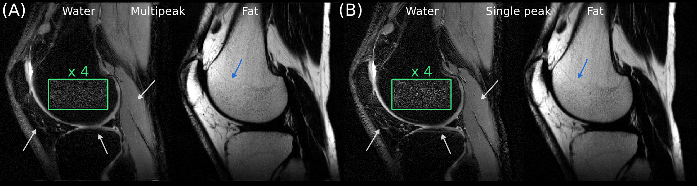



dBW-RARE Proton density weighted fat and water images reconstructed with a multi-peak (<b>a</b>), and single-peak (<b>b</b>) fat model.
The image intensity inside the green box has been amplified to better visualize the reduced residual fat in the multi-peak reconstructed water image.
The single-peak water image contains contains artifacts not present in the multi-peak reconstructed images, as indicated by the white arrows, and the growth plate is better delineated in <b>a</b> (blue arrow).
Images were acquired with ta = 4.2 ms.

-----

> **[{{ site.author.name }}](https://staff.ki.se/people/henrry)**  
> {{ site.author.institute }}
>
{{ site.author.email }}