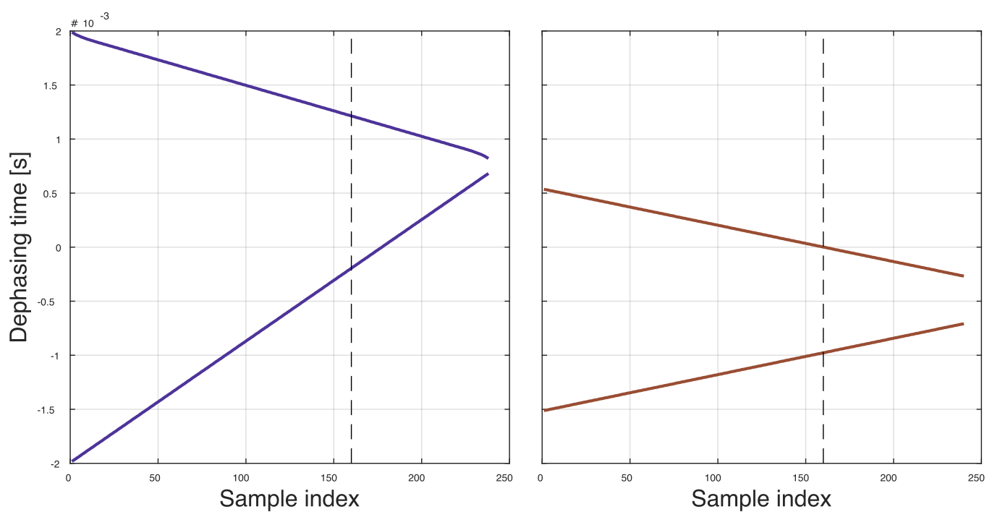
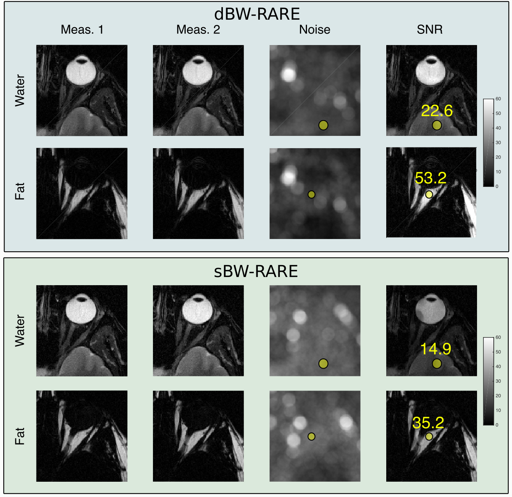



The [dBWRARE repository on GitHub](https://github.com/henricryden/dbwRARE) hosts data and scripts to reproduce the SNR measurements described here.

Sequence plot for the measurements are available here:
- [sBW-RARE [1]](../assets/plots/sbwrare.html)
- [dBW-RARE](../assets/plots/dbwrare.html)

### Data acquisition
The single bandwidth pulse sequence was implemented according to [1].
The number of shots was doubled and each phase encoding line was acquired twice in a TR interleaved manner.
Odd shots thereby form one measurement, while even shots form a second.
The scan time is doubled and the temporal difference between lines is TR (3500 ms).

Odd shots and even were independently fat/water separated.

Matrix size 320x320, field of view 240 mm, ETL = 16, partial Fourier 0.75 (both datasets), dephasing times -0.2/1.2 ms (dBW-RARE) and -1.0/0.0 (single BW)

### Noise and SNR estimation
Noise was estimated by calculated by subtracting the estimated images from measurement 1 with measurement 2.
The resulting images were squared, followed by a division of 2 to account for the overestimation from subtracting two measurements.
The resulting images were smoothed with a 6 mm circular filter to generate noise maps.
SNR maps were formed by dividing measurement 1 with the noise map.

Regions of interest were placed in the the fat surrounding the optic nerve, and in the gray matter.
The same ROIs were used for both acquisitions.

### Theoretical SNR gain comparison
A comparison between the time spent sampling can give an approximation of how much SNR improvement can be expected.
The dephasing times for sBW and dBW are shown below:

The theoretical maximum SNR improvement is the square root of the ratio between sampling durations.

### Results
The measured SNR gain was **1.515** and **1.513** from the water and fat image, respectively.
The theoretical gain was **1.544**

-----
[1] *Wang, X. et al.* **MR Neurography of Brachial Plexus at 3.0 T with Robust Fat and Blood Suppression.** Radiology 283, 538–546 (2017)

-----
> **[{{ site.author.name }}](https://staff.ki.se/people/henrry)**  
> Karolinska Institutet
>
{{ site.author.email }}